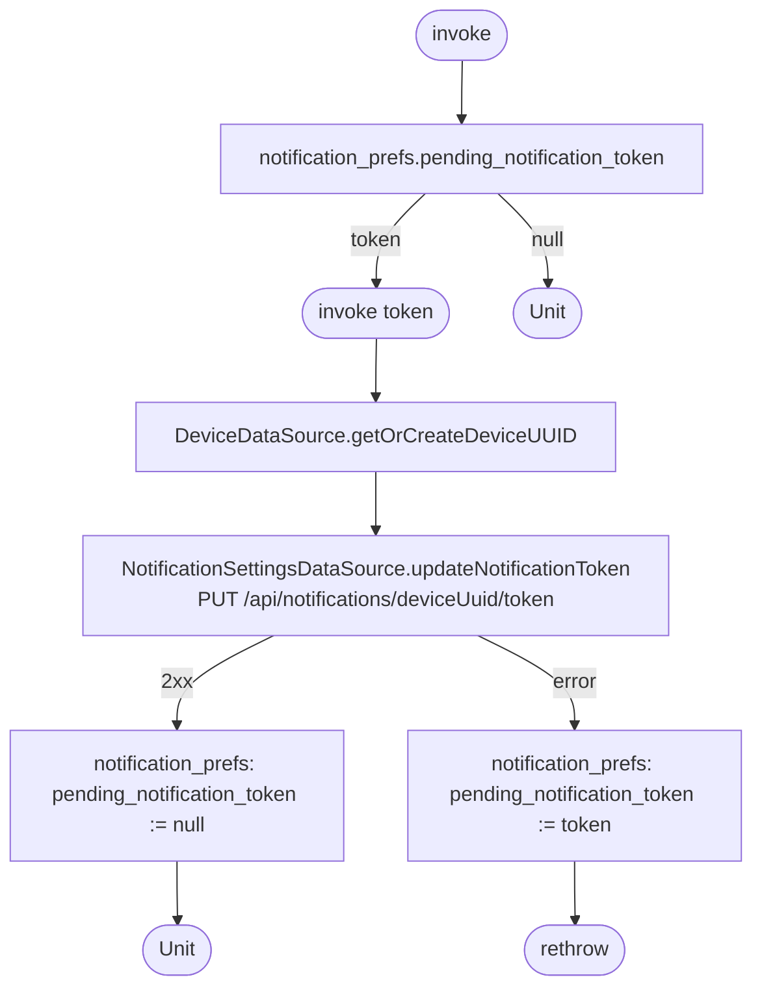

[← Operations](../README.md)

# Update notification token

`UpdateNotificationToken(token)` / `UpdateNotificationToken()` → `PUT /api/notifications/{deviceUuid}/token`
· `invoke(token)` is called from `library/notifications` `TokenBridge.updateInstallationId` when the platform
issues a push token. `invoke()` is called from [low-priority data fetch](../authorization/initial-app-data-fetch.md).

A token that fails to upload is saved as `notification_prefs.pending_notification_token` and retried by the
no-argument overload on the next low-priority fetch. A successful upload clears it.

